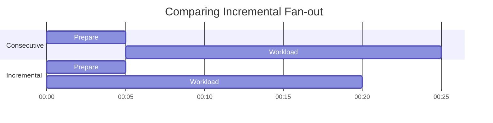

# Extended Fan-out Use Cases

There are use cases where basic fan-out doesn't give us enough control, or does not offer us the best opportunity for 
effective distribution of workloads.

## Incremental

For example, if the preparation of workloads takes some time and we would like to 'get started' on some of that work as 
soon as possible we might like to take advantage of an 'incremental' fan-out model, where we can add Tasks to a running 
Job, but not get the Fan-in callback until we've finished adding to the Job AND all the Tasks are complete.

Comparing incremental


## Multi-stage

Sometimes we want the fan-out tasks to generate further fan-out activities.

For example, preparing and sending an email to 100,000 recipients. It takes time to fetch & prepare the content for 100k 
personalised emails, so we want to fan-out this operation. But we also want to fan-out and track the send operation as 
well.

Additionally, we don't want to wait until the "prepare" Job is finished before we start the "send" (this is the 
'Incremental' pattern mentioned above) 

In this case we can model the process as a chain of 2 fanned-out Jobs, where "Stage 1" might be a Job containing 100 
Tasks, each responsible for producing and enqueueing the "Stage 2" tasks for 1,000 email recipients.

1. Send a `JobRequest` for a 2-stage fan-out, defining the first Job with `range(1, 100)` and any next action steps
    ```text
    action: prepare_recipients
    payload: campaign: 99, target_list: 42
    fanout: range(1, 100)
    next_actions: [send_emails]
    ```
   **OR** does `action` become an array field, implicitly starting a chain when >1 component
    ```text
    action_chain:[prepare_email, send_email]
   ```


2. Each of the 100 `Tasks` for our first `Job` fetches, validates and prepares the data for 1,000 email recipients

    Because these tasks are part of a defined Job Chain...
    - The Task contains "next job" information (ID, action)
    - we can (and usually should), as part of emitting the usual `TaskOutcome` message, send additional fanout 
      parameters, such as `foreach(<recipient1...1000>)`

3. The second Job in the chain starts work as soon as the first `TaskOutcome` with fanout instructions is received.

    However, we only consider the second Job eligible for fan-in once ALL the Tasks from Stage 1 have completed or failed.