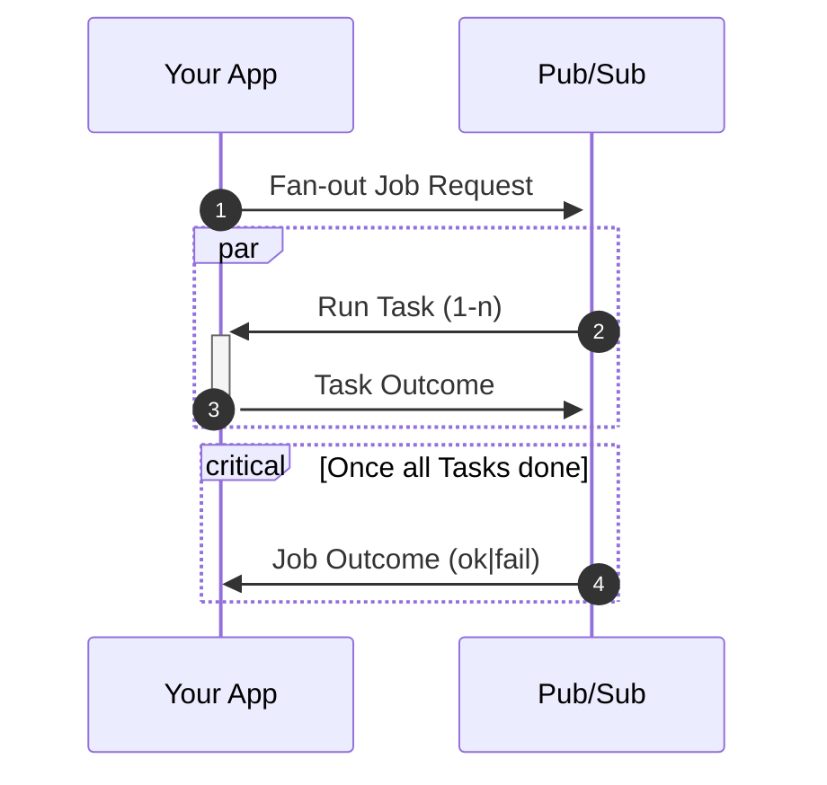

# FanFan - a Serverless Fan-out, Fan-in Framework for Google Cloud Pub/Sub

## Overview

FanFan behaves like a "plugin" for Pub/Sub - adding task Fan-out, Fan-in behaviours.


1. You emit a single `JobRequest` message (range, foreach or fixed fan-out spec)
2. FanFan generates _n_ `Task` messages, emits them to Pub/Pub & tracks their status
3. Your application handles each `Task` message, emitting a `TaskOutcome` for each
4. FanFan collates the responses and emits a `JobOutcome` when all tasks have succeeded, failed or timed out.

FanFan works well in local development environments (in Docker, with the Pub/Sub emulator). In production, it is intended to be deployed to Google Cloud Run, but should work in Kubernetes too.

## Table of Contents

* [How it Works - Pub/Sub Touch Points](#how-it-works---pubsub-touch-points)
* [Framework Components](#framework-components)
* [Example Message Formats](#example-message-formats)
  * [Fan-out Models](#fan-out-models) 
  * [JobRequest](#jobrequest), [Task](#task), [TaskOutcome](#taskoutcome), [JobOutcome](#joboutcome)
* [Get Started - Add FanFan to Your Project with Docker Compose](#getting-started---add-fanfan-to-your-project-with-docker-compose)
* [Client Libraries](#client-libraries)
* [Running in Google Cloud](#run-in-google-cloud)

## How it Works - Pub/Sub Touch Points
**FanFan introduces 4 touch points (topics) between your application and Pub/Sub**. By default these topics each have a single push subscription.

Once FanFan is deployed, it should be transparent to your application as all integration is via Pub/Sub messages.


A more detailed sequence diagram including the FanFan service can be found [SEQUENCE.md](SEQUENCE.md)

## Framework Components

The framework consists of
- A set of **~4x Pub/Sub topics** & associated (usually push) subscriptions
- The **FanFan Cloud Run Service** with **Cloud Memorystore** (or **any Redis**)
- **Client libraries** for your application
  - or your own format-compliant Pub/Sub Message emitters / responders

### Topics & Subscriptions

A minimum of 4x Pub/Sub topics & subscriptions are required.

Tooling/scripts are provided to set these up for local development and in your Google Cloud project.

1. **fanfan-job-request** `JobRequest`

    Used by your app to submit fan-out requests. 


2. **fanfan-task** `Task`

    This is where all the fanned-out tasks get sent. 

    Your application must respond - either by HTTP push (the default) or pull subscription.

    More notes on scaling options later. 

    See below for details of an optional 5th "dead letter" topic.


3. **fanfan-task-done** `TaskOutcome`

    For each task, you will need to submit an outcome 


4. **fanfan-job-done** `JobOutcome`

    And finally, once all Tasks are complete, FanFan will publish a final message for your app to consume.


5. (Optional) **fanfan-task-dead-letter** `Task`

    Recommended for improved error handling.

    This ensures that FanFan knows when a task has failed to be processed by the task handler.

    
More advanced setup for topics & subscriptions is possible depending on your use case. Options include, but are not limited to:

- Custom Pub/Sub topic (per Job, for all `Task`s in that Job)
- Custom Pub/Sub topic (per Job, for the final `JobOutcome` message)
- Pub/Sub attributes (for routing)
- Pull subscriptions
- [Google Cloud Tasks as buffer/rate-limiter](https://cloud.google.com/blog/products/serverless/buffer-http-requests-with-cloud-tasks)


## Example Message Formats

The provided client libraries abstract away the underlying JSON data structures, but these will give you an idea of the flow of data & messages through the framework:

Full JSON Schema & spec to follow (@todo).

### Fan-out Models

Three different fan-out models are supported - foreach, range and fixed.

JSON payload examples are below, but these structured are abstracted away in the [client libraries](#client-libraries).

* **Foreach** - generates one task for each value in the set, which is passed as a named payload parameter
  * Pseudocode example: `foreach ['cat', 'dog', 'mouse'] as 'pet'`
* **Range** - allows for stepped ranges, where each task
  * Pseudocode example: `for range(1900, 2000) as 'year'`
* **Fixed** - the simplest type, creating _n_ identical tasks

### `JobRequest`
This is the initial instruction sent by your application to create a fanned-out workload.

#### Foreach
```json
{
  "action": "action_string",
  "fanout": {
    "foreach": {
      "as": "some_field",
      "items": [ 10, 6, 82 ]
    }
  },
  // Optional payload
  "payload": {
    "other": "data"
  }
}
```
#### Range
```json
{
  "action": "action_string",
  "fanout": {
    "range": {
      "as": "some_field",
      "start": 1,
      "stop": 10,
      "step": 1
    }
  }
}
```
#### Fixed
```json
{
  "action": "action_string",
  "fanout": {
    "tasks": 1000
  }
}
```

### `Task`
Every Task comes to your application in this format.
```json
{
  "jobId": "uuid4fmt-job1-4e45-b280-5091c8f3cd69",
  "taskId": "uuid4fmt-task-4623-b368-b6103a6ad738",
  "action": "action_string",
  "payload": {
    "some_field": 10,
    "other": "data"
  },
}
```

### `TaskOutcome`
For each Task processed, you emit a message as follows. Status string enumerations are provided in the client libraries.

The `payload` property may be used in future versions for pipeline or map-reduce style operations where we need to capture the output of a Task.
```json
{
  "jobId": "uuid4fmt-job1-4e45-b280-5091c8f3cd69",
  "taskId": "uuid4fmt-task-4623-b368-b6103a6ad738",
  "status": "SUCCEEDED",
  "payload": null
}
```

### `JobOutcome`
And finally, once all tasks have succeeded or failed, your application is informed.

The `request` property always contains a copy of the original `JobRequest`.

The `payload` property may be used in future versions for pipeline or map-reduce style operations where we need to present the output of a Job.
```json
{
  "jobId": "uuid4fmt-job1-4e45-b280-5091c8f3cd69",
  "status": "SUCCEEDED",
  "taskCounts": {
    "SUCCEEDED": 1,
    "FAILED": 0
  },
  "startedTsp": 286965000,
  "tookMs": 50,
  "payload": null,
  "request": {
    "action": "action_string",
    "fanout": {
      "foreach": {
        "as": "some_field",
        "items": [ 10, 6, 82 ]
      }
    },
    "payload": {
      "other": "data"
    }
  }
}
```

## Getting Started - Add FanFan to Your Project with Docker Compose

For available docker tags, see the [Dockerhub page](https://hub.docker.com/r/fluentthinking/fanfan/tags).

You will need 3 additional services as follows.

You can use any of the Pub/Sub emulators recommended by Google, here I use an image with some additional tooling that 
runs on port 8681, which we need to configure in the other services.
```yaml
# PubSub Message Bus, exposes port 8681
pubsub-emulator:
  image: fluentthinking/gcloud-pubsub-emulator:latest
```

Out-of-the-box Redis
```yaml
# FanFan Persistence Layer
redis:
  image: redis:6.2-alpine
  restart: always
  command: redis-server --loglevel warning
```

And finally, FanFan itself. We need to tell it where to find Redis, the Pub/Sub emulator & the Push subscription target 
for your application. This is where the Pub/Sub emulator will send `Task` and `TaskOutcome` payloads (i.e. how your app 
executes the workloads)

```yaml
# FanFan API
fanfan:
  image: fluentthinking/fanfan:latest
  environment:
    # Which port should the FanFan API expose?
    PORT: 8080
    # Where is the Pub/Sub emulator?
    PUBSUB_EMULATOR_HOST: pubsub-emulator:8681
    # Project name for building Pub/Sub topics & subscriptions
    GCP_PROJECT: get-fanfan
    # Redis server
    REDIS_HOST: redis
    REDIS_PORT: 6379
    # Pub/Sub Push endpoints
    APP_PUSH_TARGET: http://myapp:8080
    # FANFAN_PUSH_TARGET: http://fanfan:8080
  depends_on:
    - redis
    - pubsub-emulator
```

### Did that work?

If you've set up your compose file correctly, you should see something like this appear when you run `docker-compose up`

```text
PubSub emulator ready
Setting up topics, subscriptions
Creating topic [projects/get-fanfan/topics/fanfan-job-request]
Creating topic [projects/get-fanfan/topics/fanfan-task]
Creating topic [projects/get-fanfan/topics/fanfan-task-done]
Creating topic [projects/get-fanfan/topics/fanfan-task-dead-letter]
Creating topic [projects/get-fanfan/topics/fanfan-job-done]
Subscription created [projects/get-fanfan/subscriptions/fanfan-job-done-push] (push)
Subscription created [projects/get-fanfan/subscriptions/fanfan-task-done-push] (push)
Subscription created [projects/get-fanfan/subscriptions/fanfan-task-dead-push] (push)
Subscription created [projects/get-fanfan/subscriptions/fanfan-job-request-push] (push)
Subscription created [projects/get-fanfan/subscriptions/fanfan-task-push] (push) w/DeadLetter
Starting FanFan
```

### What Next?

Once you have the FanFan infrastructure running, you can use our [client libraries](#client-libraries) to emit `JobRequest` payloads (or 
build them yourself) to the `projects/get-fanfan/topics/fanfan-job-request` topic.

## Client Libraries

- [PHP FanFan Client](https://github.com/thinkfluent/fanfan-client-php)

## Run in Google Cloud

Installation steps using the `gcloud` cli tool can be found here [INSTALL_GCLOUD.md](INSTALL_GCLOUD.md)
