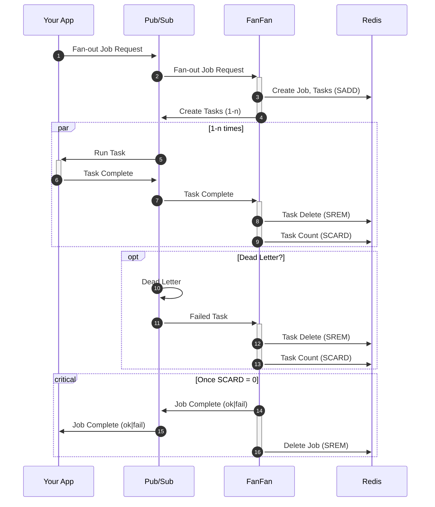

# FanFan - Detailed Sequence Diagram

FanFan - a Serverless Fan-out, Fan-in Framework for Google Cloud Pub/Sub.

Including the Redis storage layer...

```mermaid
sequenceDiagram
    autonumber
    Your App->>+Pub/Sub: Fan-out Job Request
    Pub/Sub->>+FanFan: Fan-out Job Request
    FanFan->>Redis: Create Job, Tasks (SADD)
    FanFan->>-Pub/Sub: Create Tasks (1-n)
    par 1-n times
        Pub/Sub->>+Your App: Run Task
        Your App->>-Pub/Sub: Task Complete
        Pub/Sub->>+FanFan: Task Complete
        FanFan->>Redis: Task Delete (SREM)
        FanFan->>-Redis: Task Count (SCARD)
    end
    opt Dead Letter?
        Pub/Sub->>Pub/Sub: Dead Letter
        Pub/Sub->>+FanFan: Failed Task
        FanFan->>Redis: Task Delete (SREM)
        FanFan->>-Redis: Task Count (SCARD)
    end
    critical Once SCARD = 0
        FanFan->>Pub/Sub: Job Complete (ok|fail)
        activate FanFan
        Pub/Sub->>Your App: Job Complete (ok|fail)
        FanFan->>Redis: Delete Job (SREM)
        deactivate FanFan
    end
```
